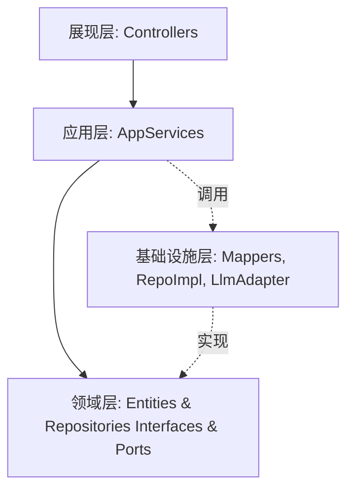

# 技术设计：重构 DDD 架构与充血模型

## 背景和当前状态
当前应用采用了经典的 MVC 三层架构（Controller -> Service -> Mapper/Entity）。在 `GleanService` 和 `AiSynthesisService` 中，存在着非常多的过程式业务逻辑，导致实体（Entity）完全贫血，仅退化为数据库映射对象。

## 目标
**目标：**
- 重构服务端工程结构为标准的分层 DDD 架构（展现层，应用层，领域层，基础设施层）。
- 将过程式的业务逻辑下沉为领域实体的具体行为（充血模型）。
- 梳理依赖关系，实现领域层纯粹性（通过 Repository 接口解耦 MyBatis Plus 的 Mapper）。
- API 不变，平滑重构。

## 上下文与架构图


## 关键设计决策及包结构调整细节

包结构将彻底改造为：
```
com.gleanread.server
├── interfaces
│   └── rest                <- 原来的 controller 移动到这里
├── application
│   ├── service             <- 业务编排级别的 AppService，如 GleanAppService, SynthesisAppService
│   └── dto                 <- 原 domain.dto 移动到此处，或者 interfaces 中
├── domain
│   ├── model
│   │   ├── fragment        <- Fragment, FragmentRepository 接口
│   │   ├── tag             <- Tag, TagRepository 接口
│   │   └── tree            <- KnowledgeTreeNode, KnowledgeTreeRepository 接口
│   └── port                <- 外部能力端口声明，如 LlmPort 移至此类
└── infrastructure
    ├── persistence
    │   ├── mapper          <- 原来的 mapper
    │   └── repository      <- FragmentRepositoryImpl, TagRepositoryImpl (调用 mapper)
    └── llm                 <- DeepSeekLlmAdapter, MockLlmAdapter 等实现
```

**充血模型设计细节：**
1. **`Fragment` (知识碎片)**
   - 行为：`public void mountToNode(Long topicNodeId)` 用于碎片归档认领。
   - 行为：静态工厂方法 `public static Fragment create(...)`
2. **`Tag` (标签)**
   - 行为：`public void incrementHeat()` 用于热度自增。
   - 行为：静态工厂方法 `public static Tag createNew(String tagName)`
3. **`KnowledgeTreeNode` (知识树节点)**
   - 行为：静态工厂方法 `public static KnowledgeTreeNode create(...)` 构建节点结构。
4. **Repository (仓储)**
   - 针对各聚合根建立对应 Repository 接口，分离对 `*Mapper` 的直接依赖，由 Mapper 转到 Infrastructure 层作为基础设施实现。

## 风险 / 权衡
- **成本/学习风险**：对于熟悉 MyBatis Plus 并习惯 CRUD 事务脚本的开发者来说，会有一定的上手门槛。
- **框架耦合妥协**：考虑到代码迁移成本，领域实体依然保留 `@TableName` 和 `@TableId` 注解，避免额外映射防腐层的冗余开销（即 MyBatis Plus 仍然侵入 Entity ）。这是针对中小项目的务实妥协策略。
